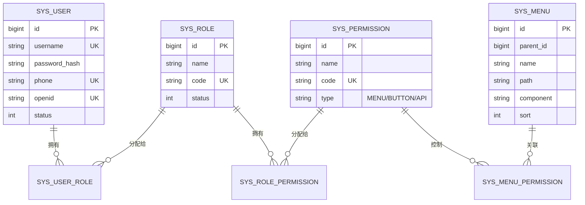
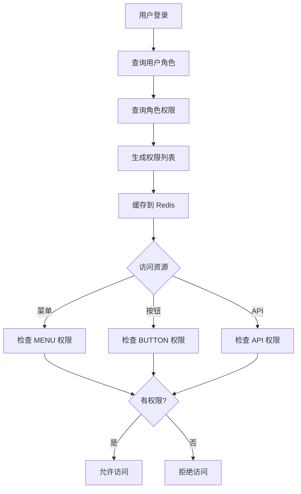

# YiYa AI Reader - 系统架构设计文档

> **版本**: 1.0.0  
> **创建时间**: 2026-01-06  
> **最后更新**: 2026-01-07

---

## 一、项目概述

YiYa AI Reader 是一个完整的三端应用系统,采用前后端分离架构,实现了基于 RBAC 的权限管理体系。

### 技术选型

| 端 | 技术栈 | 说明 |
|---|---|---|
| **管理端** | Vue3 + Vite + Pinia + Element Plus | 现代化、简洁美观的管理界面 |
| **后端** | Python 3.13 + FastAPI + MySQL 8 + Redis | 高性能异步 API 服务 |
| **小程序** | 微信原生小程序 | 轻量级用户端应用 |

---

## 二、目录结构

```
yiya_ai_reader/
├── admin-web/                      # 管理端前端
│   ├── src/
│   │   ├── api/                    # API 接口封装
│   │   ├── assets/                 # 静态资源
│   │   ├── components/             # 公共组件
│   │   ├── layouts/                # 布局组件
│   │   ├── router/                 # 路由配置（动态路由）
│   │   ├── stores/                 # Pinia 状态管理
│   │   │   ├── user.ts            # 用户状态
│   │   │   ├── permission.ts      # 权限状态
│   │   │   └── menu.ts            # 菜单状态
│   │   ├── utils/                  # 工具函数
│   │   │   ├── request.ts         # Axios 封装
│   │   │   └── permission.ts      # 权限判断工具
│   │   ├── views/                  # 页面组件
│   │   │   ├── login/             # 登录页
│   │   │   ├── dashboard/         # 仪表盘
│   │   │   └── system/            # 系统管理
│   │   │       ├── user/          # 用户管理
│   │   │       ├── role/          # 角色管理
│   │   │       ├── permission/    # 权限管理
│   │   │       ├── menu/          # 菜单管理
│   │   │       └── audit/         # 审计日志
│   │   ├── App.vue
│   │   └── main.ts
│   ├── package.json
│   └── vite.config.ts
│
├── server/                         # 后端服务
│   ├── app/
│   │   ├── api/                    # API 路由
│   │   │   └── v1/                # API v1 版本
│   │   │       ├── auth.py        # 认证接口
│   │   │       ├── user.py        # 用户接口
│   │   │       ├── role.py        # 角色接口
│   │   │       ├── permission.py  # 权限接口
│   │   │       ├── menu.py        # 菜单接口
│   │   │       └── audit.py       # 审计日志接口
│   │   ├── core/                   # 核心配置
│   │   │   ├── config.py          # 配置管理
│   │   │   ├── security.py        # 安全相关（JWT、密码加密）
│   │   │   └── dependencies.py    # 依赖注入
│   │   ├── db/                     # 数据库
│   │   │   ├── session.py         # 数据库会话
│   │   │   └── redis.py           # Redis 连接
│   │   ├── models/                 # 数据模型
│   │   │   ├── user.py            # 用户模型
│   │   │   ├── role.py            # 角色模型
│   │   │   ├── permission.py      # 权限模型
│   │   │   ├── menu.py            # 菜单模型
│   │   │   └── audit_log.py       # 审计日志模型
│   │   ├── schemas/                # Pydantic 模式
│   │   │   ├── user.py
│   │   │   ├── role.py
│   │   │   ├── permission.py
│   │   │   ├── menu.py
│   │   │   └── common.py          # 通用模式（分页、响应）
│   │   ├── services/               # 业务逻辑
│   │   │   ├── auth_service.py    # 认证服务
│   │   │   ├── user_service.py    # 用户服务
│   │   │   ├── rbac_service.py    # RBAC 服务
│   │   │   └── audit_service.py   # 审计服务
│   │   ├── middleware/             # 中间件
│   │   │   ├── auth.py            # 认证中间件
│   │   │   └── audit.py           # 审计中间件
│   │   └── main.py                 # 应用入口
│   ├── requirements.txt
│   └── .env.example
│
├── miniapp/                        # 微信小程序
│   ├── pages/                      # 页面
│   │   ├── index/                 # 首页
│   │   ├── login/                 # 登录页
│   │   └── profile/               # 个人中心
│   ├── components/                 # 组件
│   ├── utils/                      # 工具函数
│   │   ├── request.js             # 请求封装
│   │   └── auth.js                # 认证工具
│   ├── app.js
│   ├── app.json
│   └── app.wxss
│
├── deploy/                         # 部署配置
│   ├── docker/
│   │   ├── Dockerfile.admin       # 管理端镜像
│   │   └── Dockerfile.server      # 后端镜像
│   ├── nginx/
│   │   └── nginx.conf             # Nginx 配置
│   ├── docker-compose.yml         # Docker Compose 配置
│   └── .env.example               # 环境变量示例
│
└── docs/                           # 文档
    ├── database/
    │   └── schema.sql             # 数据库初始化脚本
    ├── architecture.md            # 架构设计文档（本文档）
    └── deployment.md              # 部署文档
```

---

## 三、RBAC 权限设计

### 3.1 设计模型

采用 **RBAC (Role-Based Access Control)** 模型,核心关系为:

```
用户 (User) ←→ 角色 (Role) ←→ 权限 (Permission) ←→ 菜单 (Menu)
```

### 3.2 核心实体关系



### 3.3 权限类型

| 类型 | 说明 | 示例 |
|---|---|---|
| **MENU** | 菜单权限 | `system:user:view` - 用户管理菜单 |
| **BUTTON** | 按钮权限 | `system:user:create` - 创建用户按钮 |
| **API** | 接口权限 | `api:user` - 用户相关 API |

### 3.4 菜单与权限关系

**设计原则**:
- **菜单独立管理**: 菜单树结构独立维护,支持层级嵌套
- **权限点控制**: 每个菜单关联多个权限点(查看、增删改等)
- **动态路由**: 前端根据用户权限动态生成路由表

**关系说明**:
```
菜单 (Menu)
  ├── 关联权限 (Permission)
  │     ├── MENU 类型: 控制菜单是否显示
  │     ├── BUTTON 类型: 控制页面内按钮是否显示
  │     └── API 类型: 控制后端接口是否可访问
  └── 通过角色授权给用户
```

**选择原因**:
1. **灵活性**: 菜单与权限解耦,可独立调整菜单结构而不影响权限配置
2. **细粒度**: 支持页面级(菜单)、操作级(按钮)、接口级(API)三层权限控制
3. **可扩展**: 新增功能只需添加权限点并关联到菜单,无需修改代码
4. **易维护**: 权限配置数据化,通过管理界面即可完成权限分配

### 3.5 权限判断流程



---

## 四、API 规范

### 4.1 基础规范

| 项目 | 规范 |
|---|---|
| **协议** | HTTPS (生产环境) / HTTP (开发环境) |
| **版本** | `/api/v1` |
| **请求格式** | JSON |
| **响应格式** | JSON |
| **字符编码** | UTF-8 |

### 4.2 统一响应结构

#### 成功响应

```json
{
  "code": 200,
  "message": "success",
  "data": {
    // 业务数据
  },
  "timestamp": 1704614400
}
```

#### 错误响应

```json
{
  "code": 400,
  "message": "参数错误",
  "data": null,
  "timestamp": 1704614400
}
```

#### 分页响应

```json
{
  "code": 200,
  "message": "success",
  "data": {
    "items": [
      // 数据列表
    ],
    "total": 100,
    "page": 1,
    "page_size": 20,
    "total_pages": 5
  },
  "timestamp": 1704614400
}
```

### 4.3 错误码规范

| 错误码 | 说明 | 示例场景 |
|---|---|---|
| **200** | 成功 | 请求成功 |
| **400** | 请求参数错误 | 缺少必填参数、参数格式错误 |
| **401** | 未认证 | Token 缺失或过期 |
| **403** | 无权限 | 没有访问该资源的权限 |
| **404** | 资源不存在 | 请求的资源未找到 |
| **409** | 资源冲突 | 用户名已存在 |
| **422** | 业务逻辑错误 | 不能删除有关联数据的角色 |
| **500** | 服务器错误 | 系统内部错误 |

### 4.4 分页规范

#### 请求参数

| 参数 | 类型 | 必填 | 默认值 | 说明 |
|---|---|---|---|---|
| `page` | int | 否 | 1 | 页码(从 1 开始) |
| `page_size` | int | 否 | 20 | 每页数量(最大 100) |
| `sort_by` | string | 否 | `id` | 排序字段 |
| `sort_order` | string | 否 | `desc` | 排序方向(`asc`/`desc`) |

#### 响应字段

| 字段 | 类型 | 说明 |
|---|---|---|
| `items` | array | 数据列表 |
| `total` | int | 总记录数 |
| `page` | int | 当前页码 |
| `page_size` | int | 每页数量 |
| `total_pages` | int | 总页数 |

### 4.5 核心 API 端点

#### 认证相关

| 方法 | 路径 | 说明 |
|---|---|---|
| POST | `/api/v1/auth/login` | 用户登录 |
| POST | `/api/v1/auth/logout` | 用户登出 |
| POST | `/api/v1/auth/refresh` | 刷新 Token |
| GET | `/api/v1/auth/me` | 获取当前用户信息 |

#### 用户管理

| 方法 | 路径 | 说明 |
|---|---|---|
| GET | `/api/v1/users` | 获取用户列表(分页) |
| GET | `/api/v1/users/{id}` | 获取用户详情 |
| POST | `/api/v1/users` | 创建用户 |
| PUT | `/api/v1/users/{id}` | 更新用户 |
| DELETE | `/api/v1/users/{id}` | 删除用户 |

#### 角色管理

| 方法 | 路径 | 说明 |
|---|---|---|
| GET | `/api/v1/roles` | 获取角色列表 |
| POST | `/api/v1/roles` | 创建角色 |
| PUT | `/api/v1/roles/{id}` | 更新角色 |
| DELETE | `/api/v1/roles/{id}` | 删除角色 |
| POST | `/api/v1/roles/{id}/permissions` | 分配权限 |

#### 权限管理

| 方法 | 路径 | 说明 |
|---|---|---|
| GET | `/api/v1/permissions` | 获取权限列表 |
| POST | `/api/v1/permissions` | 创建权限 |
| PUT | `/api/v1/permissions/{id}` | 更新权限 |
| DELETE | `/api/v1/permissions/{id}` | 删除权限 |

#### 菜单管理

| 方法 | 路径 | 说明 |
|---|---|---|
| GET | `/api/v1/menus` | 获取菜单树 |
| GET | `/api/v1/menus/user` | 获取当前用户菜单 |
| POST | `/api/v1/menus` | 创建菜单 |
| PUT | `/api/v1/menus/{id}` | 更新菜单 |
| DELETE | `/api/v1/menus/{id}` | 删除菜单 |

#### 审计日志

| 方法 | 路径 | 说明 |
|---|---|---|
| GET | `/api/v1/audit-logs` | 获取审计日志列表(分页) |
| GET | `/api/v1/audit-logs/{id}` | 获取日志详情 |

#### 小程序相关

| 方法 | 路径 | 说明 |
|---|---|---|
| POST | `/api/v1/wechat/login` | 微信登录 |
| POST | `/api/v1/wechat/phone` | 获取手机号 |
| PUT | `/api/v1/wechat/profile` | 更新个人信息 |

---

## 五、数据库设计

### 5.1 核心表结构

#### 1. 用户表 (sys_user)

| 字段 | 类型 | 说明 | 索引 |
|---|---|---|---|
| `id` | BIGINT | 主键 | PK |
| `username` | VARCHAR(50) | 用户名 | UK, IDX |
| `password_hash` | VARCHAR(255) | 密码哈希 | - |
| `phone` | VARCHAR(20) | 手机号 | UK, IDX |
| `email` | VARCHAR(100) | 邮箱 | UK |
| `avatar` | VARCHAR(500) | 头像 URL | - |
| `nickname` | VARCHAR(50) | 昵称 | - |
| `gender` | TINYINT | 性别(0-未知,1-男,2-女) | - |
| `openid` | VARCHAR(100) | 微信 openid | UK, IDX |
| `unionid` | VARCHAR(100) | 微信 unionid | UK |
| `status` | TINYINT | 状态(0-禁用,1-启用) | IDX |
| `last_login_at` | DATETIME | 最后登录时间 | - |
| `created_at` | DATETIME | 创建时间 | - |
| `updated_at` | DATETIME | 更新时间 | - |
| `deleted_at` | DATETIME | 删除时间(软删除) | IDX |

#### 2. 角色表 (sys_role)

| 字段 | 类型 | 说明 | 索引 |
|---|---|---|---|
| `id` | BIGINT | 主键 | PK |
| `name` | VARCHAR(50) | 角色名称 | - |
| `code` | VARCHAR(50) | 角色编码 | UK, IDX |
| `description` | VARCHAR(200) | 角色描述 | - |
| `status` | TINYINT | 状态 | IDX |
| `created_at` | DATETIME | 创建时间 | - |
| `updated_at` | DATETIME | 更新时间 | - |
| `deleted_at` | DATETIME | 删除时间 | IDX |

#### 3. 权限表 (sys_permission)

| 字段 | 类型 | 说明 | 索引 |
|---|---|---|---|
| `id` | BIGINT | 主键 | PK |
| `name` | VARCHAR(50) | 权限名称 | - |
| `code` | VARCHAR(100) | 权限编码 | UK, IDX |
| `type` | VARCHAR(20) | 权限类型(MENU/BUTTON/API) | IDX |
| `description` | VARCHAR(200) | 权限描述 | - |
| `created_at` | DATETIME | 创建时间 | - |
| `updated_at` | DATETIME | 更新时间 | - |

#### 4. 菜单表 (sys_menu)

| 字段 | 类型 | 说明 | 索引 |
|---|---|---|---|
| `id` | BIGINT | 主键 | PK |
| `parent_id` | BIGINT | 父菜单 ID(0 为顶级) | IDX |
| `name` | VARCHAR(50) | 菜单名称 | - |
| `path` | VARCHAR(200) | 路由路径 | - |
| `component` | VARCHAR(200) | 组件路径 | - |
| `icon` | VARCHAR(50) | 菜单图标 | - |
| `sort` | INT | 排序 | - |
| `status` | TINYINT | 状态 | IDX |
| `is_external` | TINYINT | 是否外链 | - |
| `is_cache` | TINYINT | 是否缓存 | - |
| `is_visible` | TINYINT | 是否显示 | - |
| `created_at` | DATETIME | 创建时间 | - |
| `updated_at` | DATETIME | 更新时间 | - |
| `deleted_at` | DATETIME | 删除时间 | IDX |

#### 5. 用户角色关联表 (sys_user_role)

| 字段 | 类型 | 说明 | 索引 |
|---|---|---|---|
| `user_id` | BIGINT | 用户 ID | PK, FK, IDX |
| `role_id` | BIGINT | 角色 ID | PK, FK, IDX |
| `created_at` | DATETIME | 创建时间 | - |

#### 6. 角色权限关联表 (sys_role_permission)

| 字段 | 类型 | 说明 | 索引 |
|---|---|---|---|
| `role_id` | BIGINT | 角色 ID | PK, FK, IDX |
| `permission_id` | BIGINT | 权限 ID | PK, FK, IDX |
| `created_at` | DATETIME | 创建时间 | - |

#### 7. 菜单权限关联表 (sys_menu_permission)

| 字段 | 类型 | 说明 | 索引 |
|---|---|---|---|
| `menu_id` | BIGINT | 菜单 ID | PK, FK, IDX |
| `permission_id` | BIGINT | 权限 ID | PK, FK, IDX |
| `created_at` | DATETIME | 创建时间 | - |

#### 8. 审计日志表 (sys_audit_log)

| 字段 | 类型 | 说明 | 索引 |
|---|---|---|---|
| `id` | BIGINT | 主键 | PK |
| `user_id` | BIGINT | 用户 ID | IDX |
| `username` | VARCHAR(50) | 用户名 | - |
| `operation` | VARCHAR(50) | 操作类型 | IDX |
| `module` | VARCHAR(50) | 模块名称 | - |
| `description` | VARCHAR(500) | 操作描述 | - |
| `request_method` | VARCHAR(10) | 请求方法 | - |
| `request_url` | VARCHAR(500) | 请求 URL | - |
| `request_params` | TEXT | 请求参数 | - |
| `response_code` | INT | 响应状态码 | - |
| `ip_address` | VARCHAR(50) | IP 地址 | - |
| `user_agent` | VARCHAR(500) | User Agent | - |
| `execution_time` | INT | 执行时间(毫秒) | - |
| `created_at` | DATETIME | 创建时间 | IDX |

### 5.2 ER 图(文字版)

```
[用户表 sys_user] 1 ←→ N [用户角色关联表 sys_user_role] N ←→ 1 [角色表 sys_role]
                                                                          ↓
                                                                          1
                                                                          ↓
                                                                          N
                                                            [角色权限关联表 sys_role_permission]
                                                                          ↓
                                                                          N
                                                                          ↓
                                                                          1
[菜单表 sys_menu] 1 ←→ N [菜单权限关联表 sys_menu_permission] N ←→ 1 [权限表 sys_permission]

[用户表 sys_user] 1 ←→ N [审计日志表 sys_audit_log]
```

### 5.3 核心字段设计建议

1. **主键策略**: 使用 `BIGINT AUTO_INCREMENT`,支持大数据量
2. **软删除**: 关键表使用 `deleted_at` 字段实现软删除
3. **时间戳**: 统一使用 `created_at` 和 `updated_at` 记录时间
4. **索引优化**:
   - 外键字段建立索引
   - 高频查询字段(如 `username`, `phone`, `status`)建立索引
   - 联合查询字段考虑联合索引
5. **字符集**: 统一使用 `utf8mb4_unicode_ci` 支持 emoji 和多语言
6. **密码安全**: 使用 bcrypt 加密,存储哈希值
7. **微信集成**: `openid` 和 `unionid` 字段支持微信登录

---

## 六、里程碑规划

### 阶段一:核心闭环(第 1-2 周)

**目标**: 打通登录 → 鉴权 → 菜单的完整链路

- [x] 数据库设计与初始化
- [x] 后端基础框架搭建
  - [x] FastAPI 项目结构
  - [x] MySQL + Redis 连接
  - [x] JWT 认证机制
- [x] 管理端基础框架
  - [x] Vue3 + Vite 项目初始化
  - [x] Pinia 状态管理
  - [x] Axios 请求封装
- [ ] 核心功能实现
  - [ ] 用户登录/登出
  - [ ] Token 刷新机制
  - [ ] 权限验证中间件
  - [ ] 动态菜单加载
  - [ ] 动态路由生成

**验收标准**:
- 管理员可以登录系统
- 登录后根据权限显示对应菜单
- 无权限的菜单不可见
- Token 过期自动刷新

---

### 阶段二:CRUD 功能(第 3-4 周)

**目标**: 完成所有管理端 CRUD 功能

- [ ] 用户管理
  - [ ] 用户列表(分页、搜索、排序)
  - [ ] 创建/编辑/删除用户
  - [ ] 分配角色
  - [ ] 启用/禁用用户
- [ ] 角色管理
  - [ ] 角色列表
  - [ ] 创建/编辑/删除角色
  - [ ] 分配权限
- [ ] 权限管理
  - [ ] 权限列表
  - [ ] 创建/编辑/删除权限
  - [ ] 权限类型管理(MENU/BUTTON/API)
- [ ] 菜单管理
  - [ ] 菜单树展示
  - [ ] 创建/编辑/删除菜单
  - [ ] 菜单排序
  - [ ] 关联权限
- [ ] 审计日志
  - [ ] 日志列表(分页、筛选)
  - [ ] 日志详情查看
  - [ ] 操作记录自动记录

**验收标准**:
- 所有 CRUD 功能正常运行
- 数据验证完整
- 错误提示友好
- 操作有审计日志记录

---

### 阶段三:小程序开发(第 5-6 周)

**目标**: 完成微信小程序用户端功能

- [ ] 小程序基础框架
  - [ ] 项目初始化
  - [ ] 请求封装
  - [ ] 状态管理
- [ ] 微信授权登录
  - [ ] 微信登录流程
  - [ ] 获取 openid/unionid
  - [ ] 生成 JWT Token
- [ ] 用户信息管理
  - [ ] 获取手机号
  - [ ] 获取昵称头像
  - [ ] 修改个人信息
- [ ] 个人中心
  - [ ] 个人信息展示
  - [ ] 信息编辑
  - [ ] 退出登录

**验收标准**:
- 微信授权登录流程完整
- 可以获取并保存用户信息
- 个人信息可以正常修改
- 与后端 API 对接正常

---

### 阶段四:优化与部署(第 7-8 周)

**目标**: 性能优化、测试、部署上线

- [ ] 性能优化
  - [ ] 接口响应时间优化
  - [ ] 数据库查询优化
  - [ ] Redis 缓存策略
  - [ ] 前端打包优化
- [ ] 测试
  - [ ] 单元测试(后端)
  - [ ] 集成测试
  - [ ] 端到端测试
  - [ ] 压力测试
- [ ] 部署
  - [ ] Docker 镜像构建
  - [ ] Docker Compose 编排
  - [ ] Nginx 配置
  - [ ] SSL 证书配置
  - [ ] 域名绑定
- [ ] 文档完善
  - [ ] API 文档
  - [ ] 部署文档
  - [ ] 运维文档
  - [ ] 用户手册

**验收标准**:
- 接口响应时间 < 200ms
- 测试覆盖率 > 80%
- Docker 一键部署成功
- 文档完整可用

---

## 七、技术亮点

1. **动态路由**: 前端根据用户权限动态生成路由,无需硬编码
2. **细粒度权限**: 支持菜单、按钮、API 三级权限控制
3. **审计日志**: 所有敏感操作自动记录,支持追溯
4. **软删除**: 关键数据支持软删除,可恢复
5. **Redis 缓存**: 用户权限缓存到 Redis,减少数据库查询
6. **JWT 认证**: 无状态认证,支持分布式部署
7. **微信集成**: 支持微信小程序授权登录
8. **Docker 部署**: 一键部署,环境一致性保证

---

## 八、安全策略

1. **密码安全**: bcrypt 加密,盐值随机
2. **Token 安全**: JWT 签名验证,设置过期时间
3. **SQL 注入防护**: 使用 ORM,参数化查询
4. **XSS 防护**: 前端输入过滤,后端输出转义
5. **CSRF 防护**: Token 验证
6. **HTTPS**: 生产环境强制 HTTPS
7. **权限验证**: 前后端双重验证
8. **审计日志**: 记录所有敏感操作

---

## 九、扩展性设计

1. **多租户支持**: 预留 `tenant_id` 字段
2. **国际化**: 支持多语言切换
3. **主题切换**: 支持深色/浅色主题
4. **插件化**: 支持功能模块插件化扩展
5. **微服务**: 后端可拆分为多个微服务
6. **消息队列**: 预留异步任务处理能力
7. **文件存储**: 支持本地/OSS 多种存储方式
8. **数据分析**: 预留数据埋点和分析能力

---

## 十、总结

本架构设计遵循以下原则:

- ✅ **简洁至上**: 避免过度设计,保持代码简洁
- ✅ **安全第一**: 多层安全防护,保障数据安全
- ✅ **性能优先**: 合理使用缓存,优化查询性能
- ✅ **易于维护**: 清晰的目录结构,规范的代码风格
- ✅ **可扩展性**: 预留扩展点,支持未来功能迭代

通过分阶段实施,确保每个里程碑都有明确的目标和验收标准,保证项目顺利推进。
